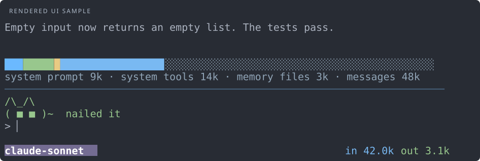
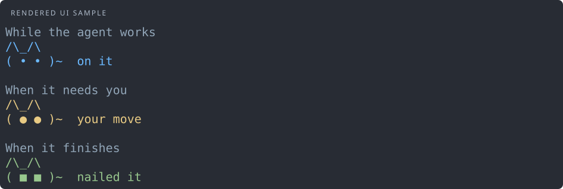
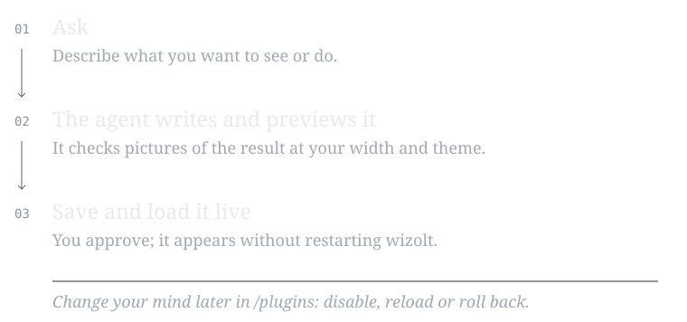
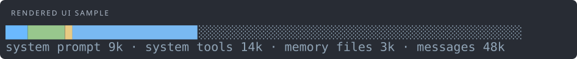
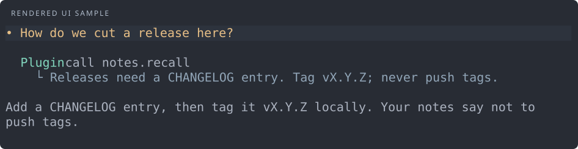

# Plugins

Plugins add small things to wizolt: a meter above the divider, a statusbar field, a `/command`,
or a new ability for the agent. You describe what you want; the agent writes the plugin.



## Try the pet

Run `/plugins`, select **pet**, then choose **enable**. A small cat sits above your input and
reacts to the agent. It is built in, disabled by default, and makes no model calls.



To move it, add this to `~/.wizolt/config.toml` and ask the agent to reload plugins:

```toml
[plugins.pet]
slot = "below_input"  # or "above_divider", "above_input"
```

## Ask the agent for one

Describe the plugin in plain words, for example:

> Make a plugin that shows what this session has cost in the statusbar.



The agent uses the built-in **plugin-workshop** skill. It checks the plugin's pictures before
showing it to you, and asks before running plugin code in your session. The request lists what
changes: which plugins are enabled, disabled, or have new code or settings. Nothing restarts.

## Examples

Each example is a complete plugin. Ask the agent to install one, or save it under
`~/.wizolt/plugins/` and say "enable and reload it".

### Context meter

Shows what fills the context window, above the divider.

<!-- figure: plugins-meter -->
```python
from wizolt.sdk import Line, Panel, Text

SDK_VERSION = 1
COLORS = ("accent", "success", "warning", "info")


def draw(context):
    window = context.window
    width = context.columns - 2
    spans, start = [], 0
    for index, (_, tokens) in enumerate(window.parts):
        end = start + round(tokens * width / max(1, window.limit))
        spans.append(Text("█" * (end - start), COLORS[index % len(COLORS)]))
        start = end
    spans.append(Text("░" * max(0, width - start), "muted"))
    names = " · ".join(f"{name} {tokens // 1000}k" for name, tokens in window.parts)
    return Panel((Line(tuple(spans)), Text(names, "muted")))


def setup(plugin):
    plugin.component("above_divider", draw)
```



### Session cost in the statusbar

Adds a `cost` field and a statusbar layout that shows it. Prices come from your config.

<!-- figure: plugins-cost -->
```python
SDK_VERSION = 1


def setup(plugin):
    prices = {"input": 3.0, "cached": 0.3, "output": 15.0}  # dollars per million tokens
    plugin.configure({"type": "object", "properties": {name: {"type": "number"} for name in prices}}, defaults=prices)

    def cost(context):
        usage, price = context.usage, plugin.config
        # Input tokens include cache reads, which providers bill at their own, lower rate.
        fresh = usage.input_tokens - usage.cached_tokens
        return (fresh * price["input"] + usage.cached_tokens * price["cached"] + usage.output_tokens * price["output"]) / 1e6

    plugin.field("dollars", cost)
    plugin.preset("statusbar", "cost", "[status.model] {model} [/]{>}[status_context]ctx {context.percent}%[/] [warning]${plugins.cost.dollars:.2f}[/]")
```


Pick **plugins.cost.cost** in `/theme`, or use `{plugins.cost.dollars:.2f}` in your own
[format](appearance.md). Set your prices:

```toml
[plugins.cost]
input = 3.0    # per million new input tokens
cached = 0.3   # per million tokens read from the provider's cache
output = 15.0
```

### A command for you

Adds `/note TEXT` to keep project notes in `.wizolt/notes.txt`.

```python
from pathlib import Path

SDK_VERSION = 1


def setup(plugin):
    async def note(context, arguments):
        path = Path(context.cwd) / ".wizolt" / "notes.txt"
        path.parent.mkdir(exist_ok=True)
        with path.open("a") as notes:
            notes.write(arguments["input"] + "\n")
        return "Noted."

    plugin.command("note", "Save a project note", note)
```

### An ability for the agent

Lets the agent read those notes when it decides they help. It asks you before each use.

```python
from pathlib import Path

SDK_VERSION = 1


def setup(plugin):
    async def recall(context, arguments):
        path = Path(context.cwd) / ".wizolt" / "notes.txt"
        return path.read_text() if path.exists() else "No notes yet."

    plugin.tool("recall", "Read the user's project notes", {"type": "object", "properties": {}}, recall)
```



## Manage plugins

Run **`/plugins`** to see each plugin, whether it is enabled, and whether it is running.
Select one and press **Enter**:

| Action | What it does |
| --- | --- |
| Enable / Disable | Turn it on or off; your choice is saved for this project |
| Reload | Load its latest code and settings |
| Rollback | Go back to the previous version |

A change made while the agent works shows **pending** and applies when the turn ends. A broken
update keeps the old version running. The statusbar shows `plugins N` while any are running.

## Settings

A plugin reads its settings from `[plugins.NAME]` in your config, like the cost example above.
After editing them, ask the agent to reload plugins. Invalid settings keep the old version.
Keep secrets in environment variables, not in plugin settings.

## Safety and recovery

- Plugins are Python with your permissions. Only enable code you trust.
- Each plugin runs in its own process, so a crash or a slow plugin cannot freeze wizolt.
- Plugin tools ask before each use; commands run only when you type them.
- If wizolt misbehaves after enabling one, start with `WIZOLT_NO_PLUGINS=1 wizolt`, then
  disable it in `/plugins`.

Plugin authors and the agent use the reference printed by `wizolt plugin paths`. SDK 1 is
experimental and may change.
