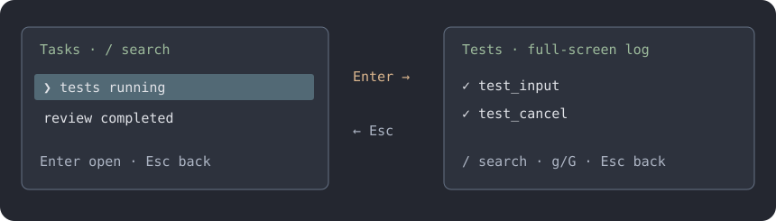

# Plugins

Plugins are either built in or installed by you. Install and enable once, then use them
in any directory.

Make wizolt yours: describe what you want, and let the agent build a plugin for you.
You do not need to write Python or edit configuration files yourself.

Your plugin settings, enabled choices, shortcuts and layout are saved in `config.toml`.
Sync it to keep your preferences on another computer; copy or reinstall your plugin source
and dependencies there too. Cached data does not need to travel with your configuration.

## Start with a wish

Tell the agent what you want to see, where it belongs, and when it should appear:

> Use plugin-workshop to add a context bar above my input. Give each category its own
> color, match my theme, and hide the legend when the terminal is short.
> Let me toggle it with /context-bar.

The built-in **plugin-workshop** skill helps the agent build and preview it. Approve the
reload to try it without restarting.

> Let me choose the pet's appearance from a menu and remember my choice for next time.
> Test choosing, cancelling and reopening before loading it.

Plugins can save their own settings. The agent can test menus with scripted answers and show
you previews. Trials use the same menu defaults and form checks as the live interface, with a
temporary config so your saved choices stay unchanged.

Keep refining it in plain language:

> Make the bar quieter. Show token counts beside the categories, and only show it while working.

Type `@plugin:` to name an installed plugin. Mentioning it does not enable or run it.

## Things to ask for

### See your context

> Show a stacked bar above the divider: one color for each part of my context window,
> with a compact legend underneath.

### Track tokens and activity

> Show this session’s input and output token counts in my statusbar, using compact
> numbers like 42k. Match my current theme.

> Show a small token-speed wave below my input, plus the current tool and this turn's
> tool-call count. Keep it to two lines.

### Add your own commands and abilities

> Add /note to save project notes. Let the agent search those notes when they help with a task.

You can also ask for a new color theme, statusbar or divider style. Plugin styles appear in
`/theme`. Panels can sit above the divider, above or below the input, or inside `/status`.

### Give your plugin an interface

> Add a searchable task list. Enter opens the selected task's full-screen log;
> Esc takes me back. Ask for confirmation before stopping a task.

Plugins can ask for text, show forms and single/multiple-choice menus, and update a live
viewer. Your input draft remains intact when you return.

> Bind F6 to my task list. Check for conflicts first.

Ask the agent to manage shortcuts through the built-in **layout** plugin. Bindings survive
restarts and become inactive when their plugin is disabled.

## Try the built-in pet

Open `/plugins`, select **pet**, then **enable**. A small cat reacts to the agent above your
input. It starts disabled and makes no model calls.

> Move @plugin:pet above the divider and reload it.

## Arrange your space

> Enable the built-in layout plugin. Put my context meter before my pet and leave one
> empty line between them.

> Remove that empty line. Keep the current order.

Order and spacing survive restarts. Disabling **layout** keeps your choices.
Without a saved order, plugins appear in name order.

Panels share up to six lines, fewer in short terminals. Gaps shrink to fit.
If `/plugins` shows a panel as hidden or clipped, ask for a more compact design.

## Manage and recover

If a plugin makes the session unusable, start **`wizolt --no-plugins`**. It skips plugin
code without deleting anything. Disable the broken plugin in `/plugins`, then restart normally.

Open **`/plugins`**, select a plugin and press **Enter**:

The list shows its source (`builtin` or `user`), whether it is enabled, and its current state.

| Action | What you get |
| --- | --- |
| Enable / Disable | Turn it on or off across projects |
| Reload | Apply its latest code and settings |
| Rollback | Restore the previous loaded version |

Changes can show **pending** during a turn or while that plugin's command is running.
Commands in other plugins do not hold up the update. A failed update or
settings save leaves the current plugin unchanged. You can ask the agent to manage it too:

> Update @plugin:pet, preview the change, then reload it. Keep its source in its own Git
> repository so I can undo changes later.

Only enable code you trust: plugins can access your files and network.
Keep secrets out of plugin source; ask the agent to use environment variables.
